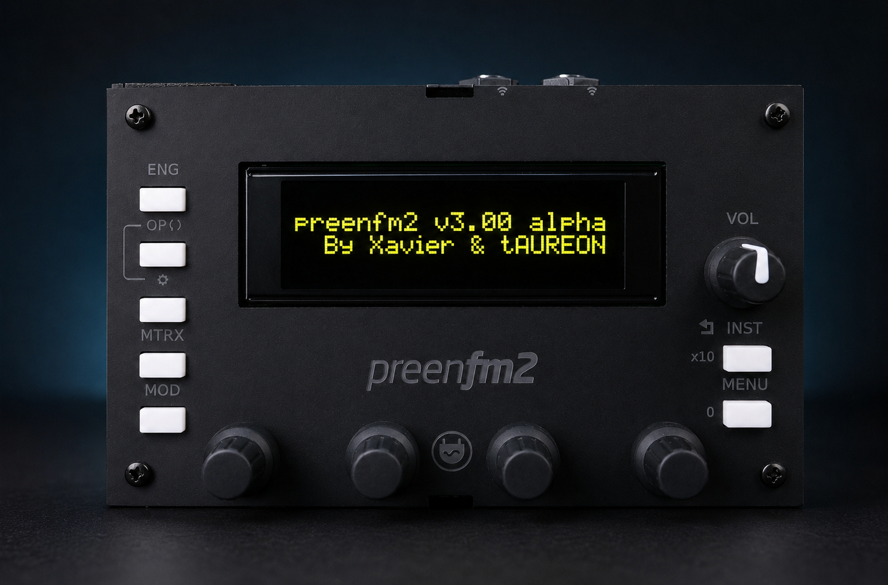

# PreenFM2 3.00 alpha firmware — VOSIM base with editor remote protocol

> ## ⚠ Hardware-tested developer pre-release — not a final firmware release
>
> The firmware in `release/editor-protocol-3.00alpha/` compiles and links cleanly with the
> prescribed toolchain, and its new data path has been reviewed statically and checked by
> simulation. The regular 3.00-alpha build has since been installed on a physical PreenFM2:
> the initial smoke test was positive, continued operation with PreenFM+ has remained
> stable, and no firmware anomaly has been observed so far.
>
> This is a developer version, not a final or general production release. Before flashing,
> follow [`HARDWARE_SMOKE_TEST.md`](release/editor-protocol-3.00alpha/HARDWARE_SMOKE_TEST.md),
> back up the USB key, and test Store first on a throwaway bank. The Store command writes
> immediately, by design, with no confirmation step.

<p align="center">
  
</p>

The physical PreenFM2 test unit running this 3.00-alpha developer firmware.

---

## What this repository is

A standalone repository for one piece of work: adding a MIDI protocol that lets a PreenFM
editor **store** the current edit buffer into a bank slot, ask the firmware **where** it
currently is, and ask **whether** the protocol is available at all.

> [!IMPORTANT]
> **Experimental AI-assisted development.** This tAUREON project explores the practical
> benefits and limits of AI-assisted work on audio and synthesizer software. The editor
> protocol and its documentation were developed through human-directed collaboration with
> OpenAI Codex and Anthropic Claude Code. Treat this firmware as experimental developer
> software and retain a known-good firmware image before flashing.

It is not a GitHub fork and not a submodule of any editor project. It carries the full
original commit history, and all GPL and copyright headers are preserved unchanged.

| | |
|---|---|
| origin of the code | [`pvig/preenfm2`](https://github.com/pvig/preenfm2) |
| branch | `vosim` |
| base commit | `6ed604a43636c00bfbac9613c8f5a79a7582dfa7` |
| working branch | `feature/editor-remote-store` |
| firmware version | `3.00 alpha` (pre-release; the base was `2.21b`) |

Remotes are set up as:

```
upstream -> https://github.com/pvig/preenfm2.git          (fetch only)
origin   -> https://github.com/sscheidl/preenfm2-vosim-editor-firmware.git
```

The `vosim` branch here is the untouched base, kept for a like for like diff. All work is
on `feature/editor-remote-store`.

### Why the VOSIM branch

`pvig/preenfm2` `vosim` carries the VOSIM algorithms 29-32 and the additional LFO shapes
6-8. Those had to be preserved, so this work is based on that branch rather than on
`master`, `dispatcher`, or the official Ixox repository. No changes from other development
branches were merged in.

The base commit `6ed604a` is also the head of
[`Ixox/preenfm2` PR #18](https://github.com/Ixox/preenfm2/pull/18), the pull request that
publishes the VOSIM work and is still open against `master`. That PR is the source behind
the `p2_2.21b_lfo_vosim.bin` build circulated on the
[ixox forum](https://ixox.fr/forum/index.php?topic=70017.15). In other words, the extended
algorithms and LFO shapes are already in this firmware's base, and `3.00 alpha` is that
build plus the editor protocol, not an alternative to it. The reference binary and the
evidence are in
[`release/fw_2.21b_lfo_vosim/`](release/fw_2.21b_lfo_vosim/README.md).

---

## What was added

Three requests on NRPN page 4, an address page every earlier firmware silently ignores:

| NRPN page / LSB | command |
|---|---|
| 4 / 0 | capability query — protocol version and capability bits |
| 4 / 1 | position query — bank type, bank, preset, valid flag |
| 4 / 2 | store — `target = (bank << 7) \| preset`, both zero based |

Responses come back on page 4, LSB 64 and above, with explicit status codes for success,
bank absent or not writable, invalid slot, ambiguous midi channel, storage error, and
protocol error.

Full byte level specification: [`release/editor-protocol-3.00alpha/EDITOR_PROTOCOL.md`](release/editor-protocol-3.00alpha/EDITOR_PROTOCOL.md).

Loading over CC 0, CC 32 and program change is unchanged, as is the full parameter dump
over NRPN 127/127. Synthesis, the VOSIM algorithms, the LFO shapes and the patch storage
format are untouched — patches stay compatible with 2.21 in both directions.

### Compatible editor and device settings

[PreenFM+ 4.0.4](https://github.com/sscheidl/preenfm2-Editor) implements this protocol,
including capability detection, position query, guarded Store and status reporting. Other
editors must implement the protocol before they can use these functions. On the device,
`Receives:` must be set to `NRPN` or `CC & NRPN`, otherwise the requests are ignored and
nothing is answered.

An editor should detect support by sending the capability query and waiting for an answer.
It must not infer support from the firmware version string.

---

## Where the results are

`release/editor-protocol-3.00alpha/`

| file | content |
|---|---|
| `p2_3.00alpha.bin` | regular firmware |
| `p2_3.00alphao.bin` | overclock firmware (byte identical, see the build report) |
| `p2_3.00alpha.elf`, `p2_3.00alphao.elf` | with debug symbols |
| `p2_3.00alpha_symbol.txt`, `p2_3.00alphao_symbol.txt` | symbol maps |
| `SHA256SUMS` | checksums |
| `editor-protocol-3.00alpha.patch` | full git diff against the base commit |
| `EDITOR_PROTOCOL.md` | protocol specification |
| `BUILD_REPORT.md` | toolchain, commands, sizes, warnings, what could not be tested |
| `FIRMWARE_SAFETY_REVIEW.md` | independent review of the store data path |
| `CHANGELOG_EDITOR_PRERELEASE.md` | change log |
| `HARDWARE_SMOKE_TEST.md` | step by step first hardware test, read this before flashing |

---

## Building

Needs [arm-gcc 4.7-2014q2](https://launchpad.net/gcc-arm-embedded/+milestone/4.7-2014-q2-update),
the version the project has always used. The toolchain is **not** part of this repository.

`GCC_PATH` in the `Makefile` still points at the original author's home directory. Either
edit it locally, or override the tool variables on the command line with the toolchain on
`PATH`, which is what the release build did:

```bash
export PATH="/path/to/gcc-arm-none-eabi-4_7-2014q2/bin:$PATH"

MK='make CC=arm-none-eabi-c++ AS=arm-none-eabi-as NM=arm-none-eabi-nm \
        READELF=arm-none-eabi-readelf CP=arm-none-eabi-objcopy'

$MK clean && $MK pfm
$MK clean && $MK pfmo
```

Always run a full `clean` between targets, as the project warns.

Automated protocol check, which complements but does not replace the subsequent
physical-hardware testing:

```bash
python test/host/protocol_sim_test.py
```

---

## Authors and license

The PreenFM2 firmware is the work of **Xavier Hosxe**. The VOSIM branch this build starts
from is maintained by **pvig**. The editor remote protocol in this repository was added by
**tAUREON**, with human-directed assistance from OpenAI Codex and Anthropic Claude Code.

The boot screen credits both: `preenfm2 v3.00 alpha` / `By Hosxe & tAUREON`.

GPL, as the upstream project. Every source file keeps its original license header and its
original author attribution unchanged. See the headers in `src/` — most carry
`Copyright 2013 Xavier Hosxe` and the GNU General Public License, version 3 or later. The
USB manufacturer string still identifies the device as Xavier Hosxe's design.

---

# Upstream README

The text below is the README of the base repository, kept for reference.

---

# preenfm2 firmware

Ixox/preenfm2 is the official repository of the preenfm2 firmware.

You can find here the compiled firmware, its code source and some hardware files for the PCB, MCU board and cases.

To flash the preenfm2 for the first time, [follow these instructions](https://github.com/Ixox/preenfm2/tree/master/flash)


## Compiling the firmware

To compile the firmware, you'll need [arm-gcc version 4.7](https://launchpad.net/gcc-arm-embedded/+milestone/4.7-2014-q2-update)

Add the bin directory to your PATH, and run **'make'**, you'll get the list of the available targets.

```bash
$ make
You must chose a target 
Don't forget to clean between different build targets
   clean : clean build directory
   pfm : build pfm2 firmware
   pfmcv : build pfm2 firmware for Eurorack 
   installdfu : flash last compiled firmware through DFU
   zip : create zip with all inside
```
Since some refactoring, the bootloader does not compile anymore. But it's available in its binary format.

Then put your preenfm2 in [bootloader mode](http://ixox.fr/preenfm2/manual/upgrade-firmware/). Look at DFU part 4.

To flash the firmware on the preenfm2 using the DFU protocol :

```bash
make installdfu
```

Once it's done, unplug the power cable and plug it back.

## New Filters in 2.11

Many effects have been added in the firmware 2.11. They were coded by [Toltekradiation](http://ixox.fr/forum/index.php?topic=69544.0).

His github repo is [here](https://github.com/pvig/preenfm2). You'll find there some description of the different effects.
